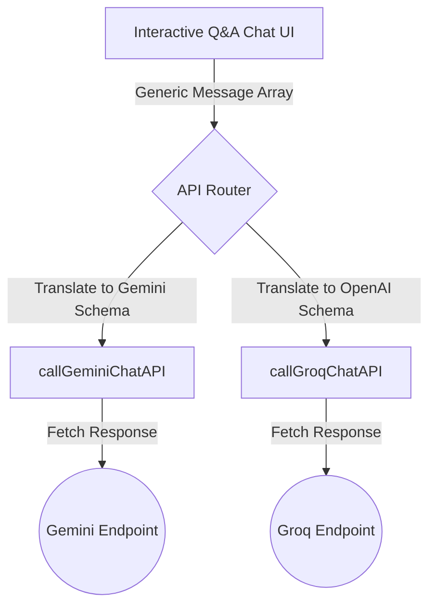

# AI Web Summarizer Sidepanel

[](#)
[](#)
[](#)
[](#)
[](#)
[](#)
[](#)

A production-grade, highly fluid, and resizable Google Chrome Side Panel extension that delivers zero-compute cloud webpage summarization and deep context-driven interactive Q&A (Mini-RAG). Designed with clean architecture principles, this extension supports dual cloud AI providers (Google Gemini & Groq Llama 3.1), implements robust local storage state management, and overcomes advanced single-page application (SPA) DOM caching restrictions.

---

## Setup & Installation

### 📋 Prerequisites (BYOK Architecture)
This extension is built on a **Bring Your Own Key (BYOK)** architecture. To use it, you must procure your own API credentials directly from the providers. There are no intermediary proxy servers or compute costs charged by the extension.
- **Google Gemini Key**: Obtain a free API key from the [Google AI Studio Console](https://aistudio.google.com/).
- **Groq API Key**: Obtain an API key from the [Groq Console](https://console.groq.com/).

### 🛠️ Developer Setup
Follow these steps to clone and load the unpacked extension in developer mode:

1. **Clone the Repository**:
   Open a terminal and run the following command to download the codebase locally:
   ```bash
   git clone https://github.com/anantha037/ai-web-summarizer-sidepanel.git
   ```
   *(Alternatively, download and extract the ZIP archive of the source code).*

2. **Access Extension Controls**:
   Open Google Chrome (or any Chromium-based browser) and navigate to the extensions management console:
   ```text
   chrome://extensions/
   ```

3. **Enable Developer Mode**:
   Locate the **Developer mode** toggle switch in the top-right corner of the window and turn it **ON**.

4. **Load the Codebase**:
   - Click the **Load unpacked** button in the top-left corner.
   - In the file selection dialog, navigate to the folder containing the cloned files (ensure you select the root directory where `manifest.json` is located) and click **Select Folder**.

5. **Pin the Icon**:
   - Click the puzzle piece icon (Extensions toolbar menu) in Chrome.
   - Find **Webpage Summarizer & Q&A** and click the pin icon next to it for quick launch visibility.

---

## Core Overview & Value Proposition

Traditional Chrome extensions rely on small, rigid, top-right popup windows that close immediately when clicking outside their boundaries, resulting in lost state and fragmented user experiences. 

**AI Web Summarizer Sidepanel** shifts this paradigm by migrating to Chrome's native **Manifest V3 SidePanel API**. This enables a persistent, dockable, and user-resizable sidebar workspace that coexists alongside the user's active browser window. With fluid layout responsiveness, the extension acts as a real-time sidekick that automatically reads, parses, summarizes, and answers questions about any webpage, selection, or video transcript instantly.

---

## Advanced Engineering Features

### 🔌 Dual-Engine AI Routing
Engineered a flexible adapter model that supports hot-swapping between **Google Gemini 2.5 Flash** and **Groq Llama 3.1 8B Instant** at runtime. API keys are managed independently, validated against live endpoints, and securely stored locally using Chrome's local sandboxed namespace.

### 📐 Fluid SidePanel Architecture
Replaced restrictive fixed-pixel layouts with fully fluid CSS rules (`width: 100%; min-width: 280px;`). Leveraging standard flexbox alignment structures, the key configurations, markdown summary boxes, and interactive RAG chat bubbles adjust dynamically as the user manually drags the sidebar width.

### 📺 SPA-Resilient YouTube Transcript Stream
Standard DOM scraping fails on YouTube due to the client-side SPA (Single Page Application) routing, which caches old DOM nodes when clicking between videos. To bypass this:
1. The extension performs a server-side fetch on the active tab's URL (`await fetch(window.location.href)`) to download the fresh, raw HTML.
2. An optimized string searching and **brace-balancing algorithm** parses the raw HTML stream to extract the hidden `ytInitialPlayerResponse` JSON metadata.
3. Retrieves the caption tracks, downloads the native track XML payload, and cleanses the timestamps using a browser-native `DOMParser` to feed clean transcript text to the AI model.

### 🎛️ Dynamic Contextual Format Toggles
Features a format selector that lets users choose between standard executive summaries, structured bullet points, or "Explain Like I'm 5" (ELI5) metaphors. The prompt engine dynamically builds contextual instructions and injects them along with page contents to alter the model output layout instantly.

### 💾 URL-Isolated Session State Persistence
To prevent transient memory loss when closing the extension or switching tabs:
- Captures tab state parameters (original summaries, page text, conversational history arrays, and selection states).
- Encapsulates and saves data packages under unique keys tied directly to the active tab's URL (`session_<URL>`) inside `chrome.storage.local`.
- Instantly re-renders state and scroll positions when returning to a previously summarized page.

### 🖱️ Context Menu Snippet Isolation
Allows users to highlight a specific sentence or paragraph on any page, right-click, and select "Summarize Highlighted Text". The background service worker captures the selection, pushes it into storage, programmatically slides open the SidePanel, and generates a summary tagged with a distinct visual "Selection" badge.

---

## Design Patterns & State Architecture

### The Adapter Pattern for Decoupled Conversational State
To support multiple underlying API structures without polluting the front-end rendering logic, we decoupled user interactions from model schemas:



- **Generic History Schema**: Pushes conversation records into a standard `{ role: "user" | "assistant", content: string }` array.
- **Translators**: Specialized translation methods (`callGeminiChatAPI` and `callGroqChatAPI`) map standard history states to their respective API-specific structures (e.g. converting role namespaces or nested object payloads) on the fly.
- **Smart Clean-Up**: When restoring conversation bubbles, the UI reads the raw stored history and strips away internal prompt context markers, ensuring the user only sees clean, user-friendly speech bubbles.

### Manifest V3 CSP Compliance
Strict Manifest V3 Content Security Policies prohibit external CDN script injections or stylesheet links to avoid vector vulnerabilities. This extension strictly complies by omitting all external CSS/JS libraries (such as Tailwind CDN) and recreating premium layouts entirely through a custom, highly optimized, and modular local stylesheet (`popup.css`).
